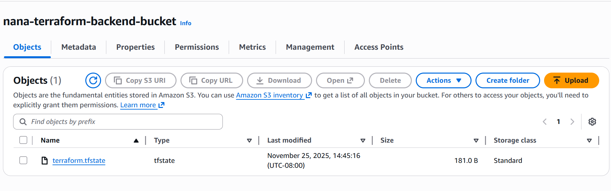
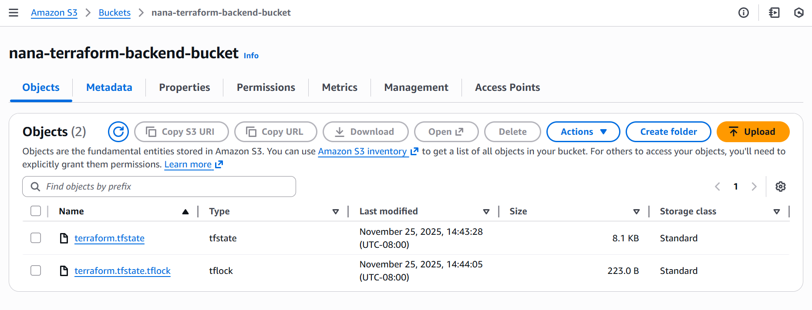

# terraform-s3-backend-lab

See lab instructions on D2L.

## Questions

### When is the state file created?

The state file is created in the S3 bucket the first time I run `terraform apply` (after `terraform init`), when Terraform actually creates or updates real resources. Before that, there is no state file in the bucket.

### When is the lock file present?

The lock file is present only while a Terraform command that modifies or refreshes state is running (for example `terraform apply`, `terraform destroy`, or some `terraform plan` operations). It appears in the bucket to prevent concurrent changes and is removed when the command finishes.

### Is the lock file always in the bucket after it is created?

No. The lock file is temporary. Terraform removes it automatically when the operation completes successfully. It should only be visible in the bucket while a state-changing operation is in progress.

## Screenshots
### The state file and lock file in the S3 bucket

